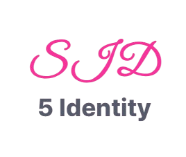
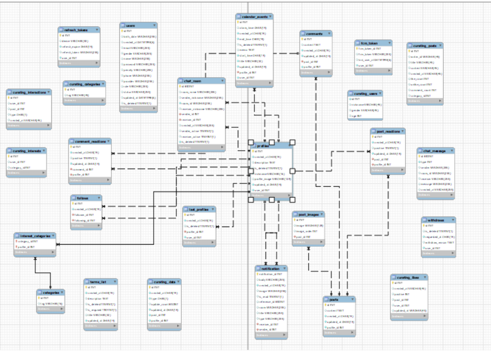
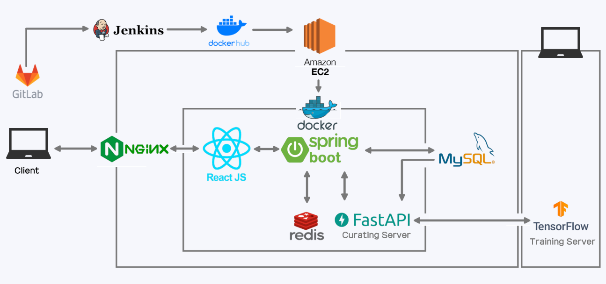

# SID (5 Identity)

## 🏆 프로젝트 개요
**SID**는 멀티프로필 기반 SNS 플랫폼 입니다.

> SSAFY C110조 공통 프로젝트  
> 개발기간: 2025.01.13 ~ 2025.02.21 (7주)

### 🎯 목표
- 사용자의 행동 기반에 맞는 피드 추천
- 사용자가 간편하게 프로필을 변경할 수 있는 기능 제공
- 사용자간의 소통 기능 제공
- 안정성과 신뢰성을 갖춘 서비스 제공

## 👨🏻‍💻 팀원
|  |  |  |  |  |  |
| :---: | :---: | :---: | :---: | :---: | :---: |
| [강건준] | [김세희] | [황학선] | [최종민] | [곽승미] | [임우섭] |
| <b> FE </b> | <b> FE </b> | <b> BE </b> | <b> Infra, BE </b> | <b> AI </b> | <b> AI </b> |

## 👩‍💻 역할 분담 (R&R)
| 이름 | 역할 |
| -------------------------------------------------------------- | ----------------------------------------------------- |
| 강건준 | 디자인 개선, 라이브러리(framer-motion 등) 적용 |
| 김세희 | UX 구현 및 개선 |
| 황학선 | JWT, 메신저 기능, 로그인 및 회원가입, 피드 기능, 멀티 프로필 기능, 일정 기능 |
| 최종민 | CI/CD, 소셜 로그인, 알림 기능 |
| 곽승미 | AI 학습 모델, 통계 페이지 |
| 임우섭 | 데이터 전처리, AI 모델 통신 시스템 구축, 데이터생성기 |

## 📋 주요 기능
### 🔐 JWT
- AccessToken과 RefreshToken으로 나눠서 쿠키를 이용해 로그인 인증 기능 구현
- RefreshToken이 존재하고 만료되지 않았으면 AccessToken 재발급 

### 🔑 소셜 로그인
- OAuth2 Code Grant 방식을 사용하여 소셜 로그인 구현
- 로그인 시 사용자 이름, 나이 등 자동 가져오기
- 신규 사용자 자동 회원가입

### 📨 메신저 기능
- WebSocket과 Stomp를 이용해서 Pub/Sub 구조로 메신저 기능 구현
- Sender가 메세지를 보내면 db와 redis에 저장 후 rabbitmq를 통해서 receiver에게 뿌려줌

### 🔔 알림 서비스
- 팔로잉한 유저의 게시글 작성 및 DM 수신 시 실시간 알림 제공
- FCM(Firebase Cloud Messaging)을 통한 구현

### 🧠 큐레이팅
- 사용자의 행동 데이터를 활용한 NCF 모델 사용으로 사용자 맞춤 추천 피드 제공
- 시퀀스적인 데이터 전처리를 통한 사용자 최근 행동 반영
- AI 모델 예측 점수 기반 + 팔로우 기반 + 최신/인기글 기반으로 추천피드 리스트 생성 알고리즘

### 🖼️ 디자인
- 래디얼 메뉴를 통한 프로필 전환 기능의 간소화 등 사용자 경험 및 접근성 위주의 디자인 구현 

### 🥇 분석
- 서비스 사용자 행동 데이터 시각화(사용자 활동량, 연령분포, 카테고리 관심도, 게시글 참여도 차트
- 특정 게시글과 유사한 글 확인 및 해당 글에 행동한 사용자의 통계 데이터를 차트로 확인 가능

  **영상 포트폴리오**: https://www.youtube.com/watch?v=CQ5AAhErPnk
  **시연 영상**: https://youtu.be/c4BP3rfa1iI

## 🔨 Tech Stack

- **Backend**: Java 17, Spring Boot 3.4.1, Spring Data JPA, OAuth2, Web Socket, STOMP, STMP
- **Frontend**: React, Vite, Node.js 18
- **Database**: MySQL, Redis
- **Infra**: AWS EC2, Docker, Nginx
- **CI/CD**: GitLab CI/CD, Jenkins
- **AI**: FastAPI, TensorFlow, ANACONDA, mlFlow, Keras

## 📊 ERD

## 🗂️ 서비스 아키텍처

- GitLab CI/CD와 Docker를 활용한 자동 배포
- 서버는 Docker 컨테이너로 배포

